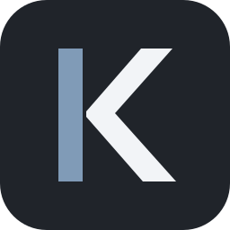

  
  <h1>KIT</h1>
  
<strong>A game environment that starts with Counter-Strike 2 and puts everything back when the game ends.</strong>

  
KIT works around the game, never inside it.

  

    
    
    
    
  

  
<a href="README.md">Русский</a> · <a href="https://github.com/sayaoff/KIT/releases/latest">Download the latest release</a>

> [!IMPORTANT]
> KIT is Alpha software. The installer, Windows startup, and application recovery flows are still undergoing clean-machine testing before the first stable release.

## Why KIT exists

Gaming often means closing background applications, starting the tools you need, and rebuilding your desktop environment afterwards. KIT groups those actions into a **Kit** and runs them automatically around a game session.

1. Select your installed `cs2.exe`.
2. Create a Kit describing what should close and what should launch.
3. KIT detects CS2, applies the Kit, and moves to the system tray.
4. When the game ends, KIT restores the environment and records the session.

## Alpha 0.1 features

- Multiple Kits plus a safe, immutable **Vanilla Kit**.
- **Clean Mode** fully closes selected applications, including tray processes.
- **Launch Apps** starts selected applications with CS2.
- Automatic **Restore** after the game and recovery after an interrupted KIT process.
- Session history with duration and average/peak CPU and RAM usage for CS2.
- System tray lifecycle, single-instance activation, and optional Windows startup.
- English and Russian interfaces with Light/Dark and Calm/Aggressive appearance modes.
- Local-only storage with no account, cloud service, or telemetry.

## Safety and transparency

KIT works **around the game**, never inside it. It does not inject code, hook or read process memory, modify CS2 files, automate game input, interact with anti-cheat software, send telemetry, or require permanent administrator privileges.

The source is public for inspection. See [Trust and transparency](docs/TRANSPARENCY.md) for every system-level action. Separate [build instructions](docs/BUILDING.md) and a [security policy](SECURITY.md) are available for technical review.

## Install

1. Open [Releases](https://github.com/sayaoff/KIT/releases/latest).
2. Download `KIT-Alpha-0.1-RC1-win-x64.zip`.
3. Fully extract the archive and run `KIT.exe`.
4. Select the installed Counter-Strike 2 `cs2.exe` from Home.

The installer definition is already included in the source and will be attached to the Release after a separate clean-Windows validation.

The Alpha is not commercially code-signed yet, so Microsoft SmartScreen may warn about a new binary. Verify the repository address and the SHA-256 value published with the release, or build KIT from source.

## Quick start

1. Open **Kits** and create a Kit.
2. Add applications to **Clean Mode** and/or **Launch Apps**.
3. Select **Save**, then **Make active**.
4. Start CS2; KIT applies the selected actions automatically.
5. Close CS2; KIT restores the environment and records the session.

> [!WARNING]
> Clean Mode first requests a normal application exit, waits two seconds, and then terminates a remaining background process. This is required for tray applications such as Telegram, but unsaved work may be lost. Add only applications you explicitly allow KIT to close.

## Roadmap

The immediate goal is a stable Alpha 0.1: installer validation, clean Windows testing, and bug fixes. GPU/VRAM metrics, session charts, Deck, and safe `.kit` import/export can follow.

FPS tracking, injection, memory reading, game-file modification, arbitrary scripts, Workshop/plugins, cloud features, and other games are outside the Alpha 0.1 scope.

## License

KIT is available under the [PolyForm Shield License 1.0.0](LICENSE). It is source-available rather than OSI open source: you may inspect, build, and use it for permitted purposes, but not to provide a product that competes with KIT.
